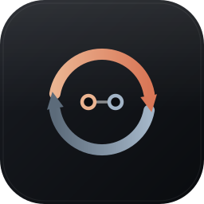

<p align="center">
  
</p>

<h1 align="center">opencode &#8596; Claude Code</h1>

<p align="center">
  Two-way session sync between <a href="https://opencode.ai">opencode</a> and
  <a href="https://claude.com/claude-code">Claude Code</a>, plus reverse-engineered
  documentation of both tools' on-disk session formats.
</p>

<p align="center">
  <a href="https://github.com/Suydev/opencode-claude-code-sync/actions/workflows/ci.yml"></a>
  <a href="https://github.com/Suydev/opencode-claude-code-sync/actions/workflows/logo.yml"></a>
  
  
</p>

<p align="center">
  <code>Linux</code> &middot; <code>macOS</code> &middot; <code>Windows (Git Bash)</code> &middot; <code>Termux / iOS (aarch64)</code>
</p>

---

Work in one, resume it in the other. Sessions appear in both tools' pickers,
keep their titles, and stay resumable — including tool calls, reasoning blocks,
and multi-megabyte histories.

**Status:** works, and is in daily use on one machine (Termux/aarch64, opencode
1.17.9, Claude Code 2.1.252). Neither format is a published API, so treat
version drift as expected — see [Compatibility](#compatibility).

---

## Why this is not a file copy

Both tools store sessions locally, so mirroring them sounds like a copy in each
direction. It is not, for three reasons that only show up once you try.

**The formats disagree on shape.** opencode keeps one SQLite database with
messages and content "parts"; Claude Code keeps append-only JSONL with a
`parentUuid` chain. A tool call is one row in one and a `tool_use`/`tool_result`
pair split across two entries in the other. Tool names and argument names differ
(`bash`/`filePath` against `Bash`/`file_path`).

**Both sides validate, differently and silently.** Claude Code refuses to resume
a transcript with an unpaired `tool_use` or an empty text block. opencode's
importer rejects a document with a bare `Missing key at ["state"]["title"]` and
no further context. Neither failure is loud.

**A naive two-way copy destroys data.** Open one session in both tools, add a
turn on each side, and whichever converter runs second overwrites the other's
work — then the loop guard stops it ever coming back. Silent, total loss.

So the interesting part is not conversion. It is deciding, per session, what
should happen: push one way, push the other, union both, or wait.

---

## Install

The installer is self-contained: run it and it fetches everything else it needs.

```sh
curl -fsSL https://raw.githubusercontent.com/Suydev/opencode-claude-code-sync/main/install.sh | bash
```

That pipes a remote script straight into `bash`, which is not a thing you should
usually do. Where `~/.claude/settings.json` is about to be edited, reading it
first is the reasonable choice:

```sh
curl -fsSLO https://raw.githubusercontent.com/Suydev/opencode-claude-code-sync/main/install.sh
less install.sh && bash install.sh
```

Or from a clone, if you intend to work on it:

```sh
git clone https://github.com/Suydev/opencode-claude-code-sync.git
cd opencode-claude-code-sync
./install.sh
```

| Flag | Effect |
| --- | --- |
| `./install.sh` | install, or re-install; safe to repeat |
| `./install.sh --dry-run` | print every change, touch nothing |
| `./install.sh --uninstall` | remove what the installer added (ledger and session data stay) |
| `./install.sh --no-wrapper` | skip the opencode exit-sync wrapper |

Requires Python 3.8+, `bash`, and both tools already installed. Nothing else is
installed: no packages, no daemon, no network calls after the first fetch.

Check it reads both stores before changing anything:

```sh
ai-sync --dry-run
```

### What it changes

| Path | Why |
| --- | --- |
| `$XDG_DATA_HOME/opencode-claude-code-sync/*.py` | the three converter modules |
| first writable dir on `PATH`/`ai-sync` | the CLI |
| first writable dir on `PATH`/`opencode` | exit-sync wrapper, only if none is there already |
| `$CLAUDE_CONFIG_DIR/hooks-sync.sh` | Claude Code `SessionEnd` hook |
| `$CLAUDE_CONFIG_DIR/settings.json` | merged, never overwritten: adds the hook and `cleanupPeriodDays` |
| `~/.bashrc` | one marked block exporting `OPENCODE_BIN` |

Nothing is hardcoded to a home directory or an install prefix. Paths come from
`$HOME`, `$XDG_DATA_HOME`, `$XDG_CONFIG_HOME` and `$CLAUDE_CONFIG_DIR`, and the
real opencode binary is *found* on `PATH` rather than assumed — upstream's
wrapper defaults to `/usr/bin/opencode`, which does not exist on most installs
and would make every launch fail with exit 127.

Overrides, if you need them: `AISYNC_HOME`, `AISYNC_REPO_URL`, `AISYNC_REF`,
`AISYNC_RAW_BASE`, `AI_SYNC_BIN`, `OPENCODE_DB`, `OPENCODE_STATE_DIR`,
`XDG_DATA_HOME`, `CLAUDE_CONFIG_DIR`.

### Automatic sync

**Claude Code** has a working `SessionEnd` hook, registered for you.

**opencode** does not — its plugin loader rejects local files in 1.17.9
([details](docs/opencode-database-format.md#11-local-plugins-do-not-load-in-1179-on-this-build)) —
so the installer wraps the binary instead. The wrapper runs the real opencode in
the foreground, then syncs once it exits, which also catches crashes and OOM
kills that an in-process hook would miss. Opt out per invocation:

```sh
OPENCODE_NO_SYNC=1 opencode
```

### Retention: read this before you rely on sync

Claude Code deletes transcripts older than `cleanupPeriodDays`, **default 30**.
Imported sessions are backdated to the original conversation time, so a
year-old import is *already past the cutoff* and can be swept on next launch.
The installer sets `cleanupPeriodDays: 3650` for you.

---

## Usage

```
ai-sync              sync, then open Claude Code's resume picker
ai-sync --quiet      sync, one summary line, no picker
ai-sync --status     per-session state, and anything on hold
ai-sync --dry-run    decide and report, change nothing
ai-sync --one <id>   a single session, by either side's id
```

`--dry-run` prints a decision and a reason per session, which is the honest way
to see what it is about to do:

```
DRY forward ses_f8fa546e2ffebvVE3D  New session          (new to Claude Code)
DRY merge   ses_fbe21d4d5ffe34WaI2  Change API Key       (both moved since last sync)
DRY reverse 020e308e                (Claude Code)        (new to opencode)
defer       ses_f99a8e634ffeNYWkex  Change API Key       (session in use)
aisync: forward=6, reverse=9, merge=16, defer=4 (dry run)
```

One-way overwrite is still available when you want a plain rebuild:
`ai-sync --raw-oc`, `ai-sync --raw-cc`.

### Termux users

Claude Code's Bash tool is broken on Termux in a way that has nothing to do
with this project: any script with a `#!/usr/bin/env` or `#!/bin/bash` shebang
fails with `bad interpreter` (exit 126), which takes out `npx`, pip entry
points, and git hooks. The cause and fix are in
[§11 of the Claude Code notes](docs/claude-code-transcript-format.md#11-termuxaarch64-specifics).

```sh
hooks/install-termux-shell-shim.sh
```

---

## Development

```sh
tests/run-tests.sh        # 54 assertions, hermetic, no network needed
tests/run-tests.sh -v     # echo each command
```

Every test builds a throwaway `$HOME` with stub `opencode` and `claude`
binaries, so the suite is safe to run on a machine that has both tools installed
for real — and that isolation is the only reason a path assumption which happens
to hold on your machine gets caught before it reaches someone else's.

CI runs the suite on Linux x86_64 and aarch64, macOS arm64 and x86_64, and
Windows under Git Bash, plus two legs that exist because of what this installer
has to survive:

- **`bare`** — a device with *neither* tool installed, asserting the installer
  warns, skips the wrapper, and still installs the CLI.
- **`termux`** — a real aarch64 Android rootfs running the whole suite. Two
  assertions are scoped out there via `AISYNC_SKIP_WRAPPER_EXEC`, because
  exec'ing a `#!/usr/bin/env bash` script directly does not work inside the
  container even with `termux-exec` installed; both pass on every other leg.
  Still marked non-blocking, since it needs the network for `pkg`.

There is no iOS runner in GitHub Actions, so the Termux rootfs job is the
closest available proxy for that platform.

[`logo.yml`](.github/workflows/logo.yml) keeps the committed rasters honest: it
re-rasterises every SVG in `assets/` and fails if the result differs, so the
sources and the PNGs cannot drift apart.

```sh
rsvg-convert -w 512 -h 512 assets/logo.svg -o assets/logo.png
for s in 256 128 64; do rsvg-convert -w "$s" -h "$s" assets/logo.svg -o "assets/logo-$s.png"; done
rsvg-convert -w 1280 -h 640 assets/social-preview.svg -o assets/social-preview.png
```

### Artwork

| File | Use |
| --- | --- |
| `assets/logo.svg` | the mark, source of truth |
| `assets/logo.png` | 512px, README and high-DPI |
| `assets/logo-256/128/64.png` | smaller sizes |
| `assets/social-preview.png` | 1280×640 card for the repo's social preview |

GitHub does not expose the avatar or social-preview fields through its API, so
`assets/social-preview.png` has to be uploaded by hand: **Settings → General →
Social preview**. Likewise a profile avatar is a browser upload, not a CLI one.

## How it decides

A ledger records what both sides looked like the last time they agreed. Without
it, the only available action is overwrite; with it, "which side changed?" is
answerable, and four outcomes become distinguishable:

| Both sides | Action |
| --- | --- |
| neither changed | **noop** |
| opencode changed | **forward** — rebuild the Claude transcript |
| Claude Code changed | **reverse** — import into opencode |
| both changed | **merge** — union, never overwrite |
| either is in use | **defer** — retry when it is free |

Fingerprints are `(message count, last id)` rather than content hashes. A
conversation only grows at the tail, so that detects every append without
reading message bodies — which matters when one side is ~20 MB and this runs
after every session.

### Merging

The opencode side is rebuilt first and used as the base, then Claude-only turns
are appended. Direction is deliberate: opencode holds the full untruncated
history while the Claude copy is already a lossy, size-capped rendering, so
rebuilding from the lossy copy would make the truncation permanent.

Turns are matched by a normalised signature — kind plus a short prefix of the
salient text — because round-tripping is lossy and ids are regenerated, so
neither id nor exact-content matching works. Both sides are first rendered into
the *same* representation before comparing; comparing an opencode message
against a Claude entry directly duplicates every API-error turn, since an error
has no opencode content parts but does render to text on the Claude side.

The union is then appended to the **existing** opencode session via
`opencode export`, rather than re-imported, which would mint a second session
holding the same conversation.

### Safety

- **Nothing is deleted.** The worst case for any session is "deferred, retry
  later". Every overwrite backs up what it replaced first.
- **Liveness is checked against `/proc`**, not the registry files — Claude Code
  leaves stale `~/.claude/sessions/<pid>.json` entries behind after crashes
  (six of seven were stale on the development machine), and those get reaped.
- **A recently-touched opencode session is deferred** even with no process
  evidence, because the TUI holds state in memory and flushes on its own
  schedule.
- **Runs are serialised** by a lock that is stolen after 30 minutes, since a
  killed sync must not wedge future ones.
- **Conversion failures degrade rather than stop.** The repair ladder reads
  opencode's own error path and retries with the offending shape simplified
  (flatten tool parts to text, drop reasoning). Repeated failures quarantine
  with doubling backoff, capped at a day, so a permanently malformed session
  costs one attempt daily instead of one per run.
- **Loop-safe.** Each importer refuses to re-export what the other brought in.
  Ids are derived from the source id, so a repeat sync updates in place.

---

## Documentation

The two format notes are the durable part of this repository. They are written
to be read by someone debugging their own tooling, not as an overview.

- **[Claude Code transcript format](docs/claude-code-transcript-format.md)** —
  the project-directory encoder, entry types, tool pairing rules, the
  `--resume` classifier, retention behaviour, the live session registry,
  cross-session messaging, and Termux specifics.
- **[opencode database format](docs/opencode-database-format.md)** — schema,
  how the context window is actually decided, the compaction failure mode that
  can silently erase a session's context, the timestamp-encoding id scheme,
  the export/import contract, and plugin-loading breakage.

Both include a "things I did not verify" section. Claims resting on a probe
rather than on reading the implementation say so.

Some findings worth calling out, because they cost hours each:

- A **slash in `message.model`** makes Claude Code's `--resume` hang forever.
  `gateway/claude-opus-5` never returns; `claude-opus-5` answers in 40 s.
  Bisected with six single-variable transcripts. Unknown bare model ids resume
  fine, so it is the shape, not recognition.
- Claude Code's project directory encoder replaces **every** non-alphanumeric
  character, so `com.termux` becomes `com-termux`. An importer that only
  replaces `/` writes to a directory that is never read.
- `parentUuid` threads through `attachment` and `system` entries, not just
  conversational ones. An integrity checker that ignores them reports valid
  native transcripts as broken.
- opencode ids **encode their creation time** in a 48-bit field, bit-complemented
  for sessions so they sort newest-first. Derive the random tail from a hash of
  the source id and imports become idempotent.

---

## Compatibility

### Session formats

| | Tested |
| --- | --- |
| opencode | 1.17.9 (also seen working on 1.18.34) |
| Claude Code | 2.1.252 (native, `linux-arm64`) |
| Platform | Termux / Android aarch64; the Python is platform-agnostic |
| Python | 3.14 (3.8+ expected to work; not verified below 3.14) |

Neither on-disk format is public API. Both tools ship frequently, and a schema
change will show up here as a conversion failure rather than as corruption:
opencode's importer validates before writing, and the repair ladder degrades
fidelity before giving up. `ai-sync --status` shows anything quarantined.

If a future version breaks something, the format notes are the place to start —
they record how each fact was established, so it can be re-checked.

### Installer

The converters are only exercised on the platforms above, but the *installer* is
tested on every leg of the CI matrix, because it is the part that has to survive
machines it was not written on:

| | CI |
| --- | --- |
| Linux | x86_64, aarch64 |
| macOS | arm64, x86_64 |
| Windows | Git Bash (no `install(1)`, no `/usr/bin/opencode`) |
| Android | aarch64 Termux rootfs, two assertions scoped out, non-blocking |
| iOS | not covered — no runner exists; Termux is the proxy |

Windows is the leg that earns its place: Git Bash has neither `install(1)` nor
the opencode path upstream's wrapper assumes, so both are exactly the failures
that would otherwise only surface for someone else.

---

## Known limitations

- **Subagent sessions are excluded by default.** Over half the sessions on the
  development machine were subagent spawns; including them floods the other
  tool's picker. `--children` opts in on the opencode side.
- **Transcripts are size-capped at 2 MB** by trimming the oldest turns on turn
  boundaries. Larger histories cannot be resumed reliably. The opencode side
  keeps the full history regardless.
- **Tool output is truncated** to 4000 characters per call, keeping both ends.
- **Reasoning blocks cross the boundary as tagged text**, not native thinking
  blocks, which need a signature that cannot be synthesised.
- **Round-tripping is lossy.** A session that goes opencode → Claude → opencode
  arrives with truncated tool output. Merge matching is designed around this,
  but the original fidelity does not come back.
- **No deletion propagation.** Deleting a session on one side leaves the other
  copy in place.
- **Single-machine.** There is no conflict model for two machines syncing the
  same store.

---

## License

MIT. See [LICENSE](LICENSE).

Not affiliated with Anthropic or the opencode project. The format documentation
describes observed behaviour of third-party software and may be wrong or
outdated; verify before depending on it.
